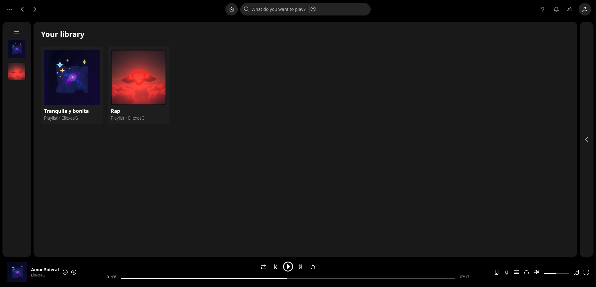
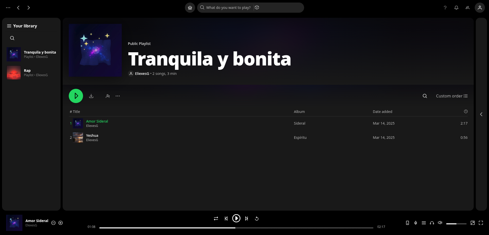
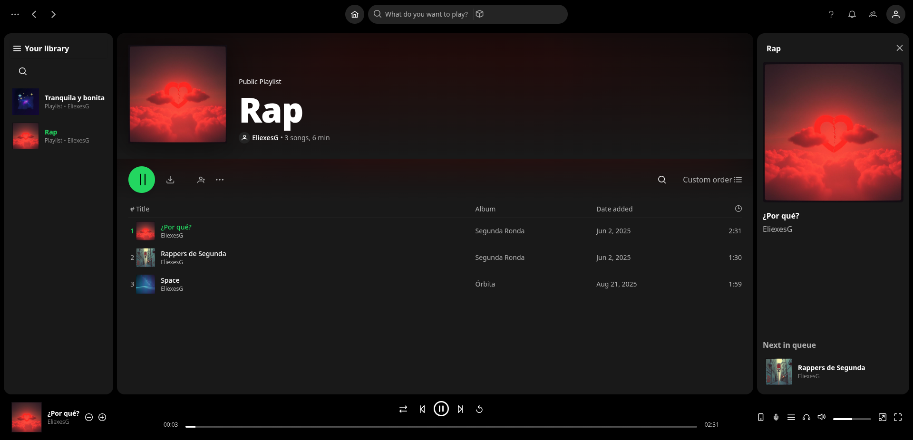

# SpotifyClone

A Spotify web-player clone built with [Angular](https://angular.dev) (v22, standalone components, zoneless) — playback is the core real functionality; the rest of the UI replicates Spotify visually.



## Development server

```bash
npm run dev
```

Open `http://localhost:4200/`. The application automatically reloads when source files change.

## Building

```bash
ng build
```

This compiles the project (with strict template type-checking) into `dist/`. Bundle budgets are enforced in production builds.

## Running unit tests

```bash
npx ng test --watch=false
```

Unit tests run with [Vitest](https://vitest.dev) via the `@angular/build:unit-test` builder (jsdom environment — no browser needed).

## Additional resources

For more information on the Angular CLI, visit the [Angular CLI Overview and Command Reference](https://angular.dev/tools/cli) page.

---

## Interactions

Everything that _actually works_ in the clone, in one map. Anything not listed here is decorative chrome by design (Premium, sign-up, create "+", legal links, bell/social/account icons…).

### Screens

**Main view** — the playlist grid: hovering a card raises the green play button, clicking the body opens the playlist and loads its queue without autoplay.


**Library view** — a playlist page: gradient header, full song table (green titles for the current track, play buttons in the title cell), live search, and the library rail on the left.



**Song playing** — the transport bar in action: shuffle/repeat states, silent scrubbing on the seek bar, and the now-playing panel showing the artwork with _Next in queue_.



### Mouse

| Where                 | Interaction                      | Behavior                                                                           |
| --------------------- | -------------------------------- | ---------------------------------------------------------------------------------- |
| **Top bar**           | ⌂ home                           | Navigate to the home grid                                                          |
|                       | ‹ / › chevrons                   | Back / forward through visit history                                               |
|                       | **?** (right cluster)            | Open the keyboard-shortcuts overlay                                                |
| **Library**           | panel header                     | Collapse ↔ expand (expand = search + cards, collapse = icon rail)                  |
|                       | card **cover**                   | Play / pause that playlist's queue                                                 |
|                       | card **row**                     | Open the playlist view + load its queue (no autoplay)                              |
|                       | search pill                      | Live filter; empty state reads `Couldn't find "X"`; clears on outside click        |
| **Home grid**         | card **body**                    | Open the playlist + load the queue (no autoplay)                                   |
|                       | floating **green button**        | Play / pause the whole playlist                                                    |
| **Playlist view**     | big **green button**             | Play / pause the playlist (state-aware)                                            |
|                       | track **row**                    | Play that track (also retry on a failed load)                                      |
|                       | track **title** (in-cell button) | Play the track, keyboard-reachable                                                 |
|                       | search pill                      | Live filter over the song table; `Couldn't find "X"` when empty                    |
| **Transport bar**     | ⇄ shuffle                        | Toggle shuffle                                                                     |
|                       | ⏮ / ⏭                            | Previous / next track                                                              |
|                       | ⏵ / ⏸                            | Play / pause                                                                       |
|                       | ↻ repeat                         | Cycle repeat: off → all → one (green icon + dot / `1` badge)                       |
|                       | seek bar                         | **Silent scrub**: drag pauses with a position preview, release commits and resumes |
|                       | volume icon                      | Mute / unmute (unmute restores the last audible volume)                            |
|                       | volume slider                    | Set output volume (steps of 10%)                                                   |
| **Now playing panel** | **×** overlay close              | Collapse to a sliver with a reopen chevron                                         |
|                       | sliver **‹** chevron             | Reopen the panel                                                                   |
|                       | **Next in queue** row            | Jump to that track and play it (hidden under shuffle / at queue end)               |

### Keyboard

All shortcuts work anywhere except while typing in a text field. Pressing <kbd>?</kbd> also suspends playback shortcuts while the overlay is open.

| Key                         | Action                             |
| --------------------------- | ---------------------------------- |
| <kbd>Space</kbd>            | Play / pause                       |
| <kbd>←</kbd> / <kbd>→</kbd> | Seek ∓5 s                          |
| <kbd>↑</kbd> / <kbd>↓</kbd> | Volume ±10%                        |
| <kbd>M</kbd>                | Mute / unmute                      |
| <kbd>S</kbd>                | Toggle shuffle                     |
| <kbd>R</kbd>                | Cycle repeat: off → all → one      |
| <kbd>N</kbd> / <kbd>P</kbd> | Next / previous track              |
| <kbd>?</kbd>                | Open / close the shortcuts overlay |
| <kbd>Esc</kbd>              | Close the overlay                  |

### Window (panel space)

The desktop layout never reflows (official web-player parity, ~810px floor — narrower windows scroll horizontally). Above ~1080px the library and now-playing panels can both be open; below that exactly one is open at a time: opening one collapses the other, and narrowing the window auto-collapses the library to its icon rail. The center panel never shrinks.

### System (OS integrations)

- **Media Session API** (where supported): track title/artist/album + artwork show in the OS media controls; the play/pause/next/previous buttons there drive the player.
- **Playback feedback**: a persistent failing-track pill (cleared when playback recovers) and a buffering spinner appear above the transport bar.

### Accessibility

Every interactive element is a native control with an accessible name (icon-only controls included), the whole UI is keyboard-reachable, track changes are announced politely (`aria-live`), and keyboard focus shows a green ring.
